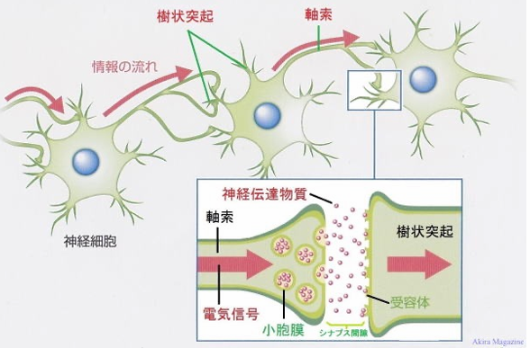
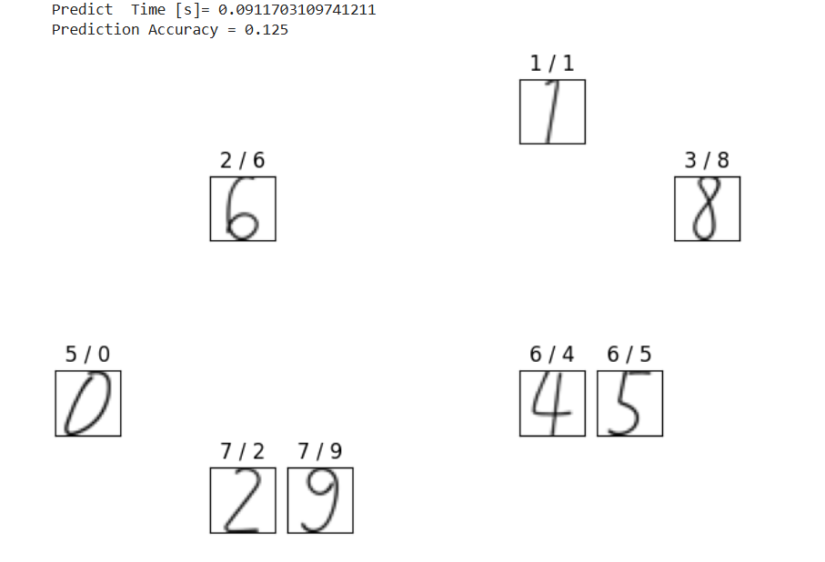
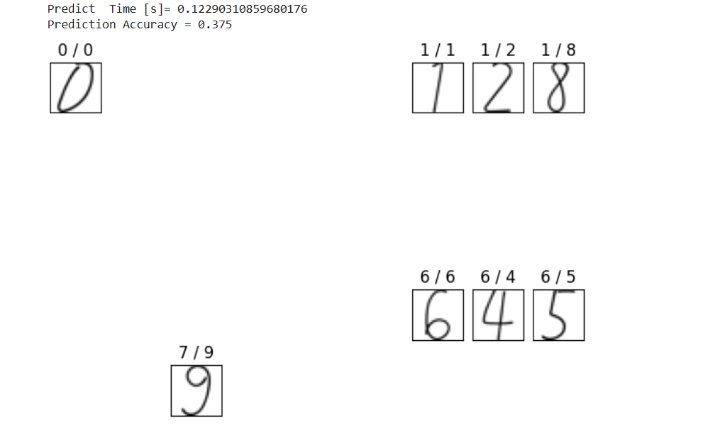

# Neural-network (ニューラルネットワーク)
## ニューラルネットワークとは
ニューラルネットワーク
ニューラルネットワークは、人間の脳神経の働きをモデル化し、コンピュータ上で脳神経回路を再現する仕組みです。これは「パーセプトロン」と呼ばれる脳細胞のような小さな計算ユニットを複数つなげて構成されます。

単層パーセプトロン: 単一層のパーセプトロンのみで構成されたニューラルネットワークの構造です。
多層パーセプトロン（MLP）: 複数の層から成るニューラルネットワークで、特に4層以上の構造を持つものは「ディープラーニング」とも呼ばれ、複雑な学習が可能です。
　
### 
 IEPOCHは学習する回数を指定します。(IEPOCH=1は学習データを1回学習します。)
### 
 RATIOは学習用データの何割(0.0〜1.0)を検証データとして使用するかを指定する。(RATIO=0.1の時は10%を検証用データ、残りの90%を学習データにする。)
### 
 ISEEDは　擬似乱数のシード値を指定する。シード値を変更すると、生成される乱数列(ランダムな数列)が変わる。
### 
 IGRAPHICは1にするとグラフなどをウィンドウ表示する。0にするとウィンドウは非表示となります。
### inetwork
 0にすると単層パーセプトロン、
 1にすると多層パーセプトロン、
### コメント
inetworkを増えるほど学習時間が増え、ともに正解率が増えます。上に載せてある手下記文字認識された結果による、inetwork=0よりinetwork=1のとき正解率が上がりました。

　
　

上の実行結果による、inetwork=0のとき正解数字１しか与えたなかった。しかし inetwork=1のとき正解数字が０、１、６が認識されました。
