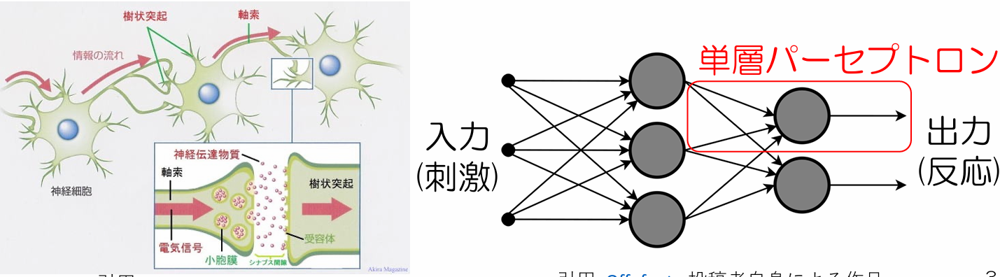

# Neural-network (ニューラルネットワーク)
## ニューラルネットワークとは
 人間の脳神経をモデル化したものでコンピュータ上に人間の脳神経回路を再現。
 脳細胞をモデル化した「単層パーセプトロン」を繋ぐ。
 * 4層以上連結したものをディープラーニングと呼びます。
 人間と同じように学習をすることで(機械学習)
 推論ができるようになる(手書き文字認識など)。
　
### 
 IEPOCHは学習する回数を指定します。(IEPOCH=1は学習データを1回学習します。)
### 
 RATIOは学習用データの何割(0.0〜1.0)を検証データとして使用するかを指定する。(RATIO=0.1の時は10%を検証用データ、残りの90%を学習データにする。)
### 
 ISEEDは　擬似乱数のシード値を指定する。シード値を変更すると、生成される乱数列(ランダムな数列)が変わる。
### 
 IGRAPHICは1にするとグラフなどをウィンドウ表示する。0にするとウィンドウは非表示となります。
### inetwork
 0にすると単層パーセプトロン、
 1にすると多層パーセプトロン、
###　結論
inetworkを増えるほど学習時間が増え、ともに正解率が　上がる。上に載せてある手下記文字認識された結果による、inetwork=0よりinetwork=1のとき正解率が上がった。
